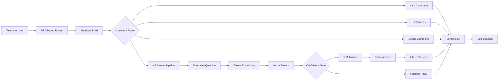

# AI Support Knowledge Base Assistant (RAG)

Portfolio MVP: a customer-support assistant that answers **strictly from a verified knowledge base**, provides **citations**, and uses safe **fallback modes** (`ALLOW` / `CLARIFY` / `NO_ANSWER`) to prevent hallucinations.

Useful links:
- `arch.md` — architecture + Envelope contract
- `plan.md` — implementation plan / checklist
- `prompts/answer.md` — strict KB-only prompt (v1)
- `tests/README.md` — E2E smoke tests (webhooks)

## Problem
Support teams rely on large, frequently changing documentation (KBs, manuals, policies, FAQs). Classic LLM assistants often:
- hallucinate (answer without evidence),
- can’t explain *where* information comes from,
- provide poor traceability and debugging.

## Solution
This project is a simple, auditable RAG system:
- **Ingest**: docs → chunking → embeddings → `kb_chunks` (pgvector)
- **Answer**: question → retrieval (top-k) → confidence gate → KB-only LLM → answer + sources
- **Logging**: each chat turn is logged for debugging/metrics (`Ops — Log chat_turn`)

## Why it matters
- Prevents hallucinations in customer-facing AI
- Provides auditable answers with clear sources
- Safe-by-design: unknown questions never produce fabricated answers
- Ready for regulated or internal company knowledge bases

## Key features (MVP)
- KB-only answering (strict prompt)
- Confidence gating: `ALLOW` / `CLARIFY` / `NO_ANSWER`
- Sources/citations included in the response
- Webhook-based ingest + answer endpoints (easy to smoke-test)
- Centralized logging with `top_score`, latency, and sources

## Reliability & Safety
- Retries and backoff for LLM and DB calls (n8n Retry on Fail)
- Timeouts on all external integrations
- Graceful fallback on errors with user-safe responses
- Centralized logging for every chat turn

## Non-goals
- Not a general chat assistant
- Not allowed to answer without KB evidence
- Not optimized for creative or open-ended conversations

## Demo script (60–90 sec)
1. Show `/sources` — list available KB documents
2. Ask a KB-backed question → answer with citations
3. Ask an out-of-scope question → `CLARIFY` / `NO_ANSWER`
4. Run `/debug` → show `top_score` and sources
5. Open Supabase → show logged `chat_turns`

## Architecture (high level)


## n8n workflows
Workflows currently live in n8n:
- `TG — Inbound Router (MVP)` — Telegram entrypoint + routing
- `KB — Ingest v1 (Webhook)` — ingest endpoint (docs → chunks → embeddings → `kb_chunks`)
- `KB — Answer v1` — answer pipeline (retrieval + gate + LLM + sources)
- `Ops — Log chat_turn` — writes logs to Postgres/Supabase

## Webhook contracts (used by smoke tests)
The repository contains E2E smoke tests that call your n8n webhooks directly.

### Ingest (`KB — Ingest v1 (Webhook)`)
POST JSON (required fields):
```json
{
  "kb_ref": "demo-support",
  "doc": "Access request process",
  "section": "Onboarding",
  "source_url": "https://example.com/access",
  "text": "# Markdown...\n\nContent...",
  "tags": ["onboarding", "access"],
  "replace": true,
  "doc_id": "optional-stable-id"
}
```

### Answer endpoint
POST JSON:
```json
{
  "kb_ref": "demo-support",
  "question": "What is the SLA for urgent requests?",
  "retrieval": { "top_k": 5 }
}
```

## Running smoke tests (local)
```bash
export N8N_INGEST_URL="https://…/webhook/…/kb/ingest"
export N8N_ANSWER_URL="https://…/webhook/…/kb/answer"

bash tests/smoke_ingest.sh
bash tests/smoke_answer.sh
node tests/unit_answer_logic.test.js
node tests/unit_tg_router_envelope.test.js
```

## Tech stack
- n8n — workflow orchestration
- OpenAI — embeddings + chat completion
- Postgres (Supabase + pgvector) — `kb_chunks` + logs
- Telegram Bot API — user interface
