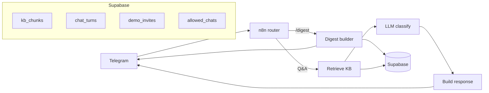

# KB RAG Assistant (Demo)
Telegram bot that summarizes a curated feed and answers strictly from sources with gating (`ALLOW` / `CLARIFY` / `NO_ANSWER`).

## What This Demo Shows
- Ingest → chunks in Supabase (pgvector)
- Retrieval + strict “answer only from KB”
- Digest with signals + recency + links
- Deterministic behavior: no hallucinations, if missing → can’t answer
- Basic safety/access: invite token + whitelist session

## Live Demo In 30 Seconds
1. Get an invite token (contact `@arsenii_ostroumov`).
2. Send `/start <token>`.
3. Send `/digest`.
4. Ask: “What are the key updates on $Whalentine?”
5. See: reply + sources.

## Key Features
- `/digest`: TL;DR (signals, coverage, tickers, recency), top signals, links
- Gating: `ALLOW` / `CLARIFY` / `NO_ANSWER`
- Citations: 1–5 sources for `ALLOW`, none otherwise
- Dedup: digest de-duplicates by canonical URL when present (fallback: doc + section)
- Observability: `trace_id`, `top_score`, `latency_ms`, sources logged in Supabase

## Architecture

```mermaid
flowchart LR
  TG[Telegram] --> R[n8n router]
  R -->|/digest| D[Digest builder]
  R -->|Q&A| RET[Retrieve KB]
  RET --> LLM[LLM classify]
  LLM --> RESP[Build response]
  D --> TG
  RESP --> TG
  D --> DB[(Supabase)]
  RET --> DB
  subgraph Supabase
    KB[kb_chunks]
    CT[chat_turns]
    INV[demo_invites]
    ALW[allowed_chats]
  end
```

## Data Model (Important Fields)
- `kb_chunks`: `kb_ref`, `doc`, `section`, `content`, `source_url`, `created_at`
- `chat_turns`: `trace_id`, `chat_id`, `question`, `answer`, `fallback_type`, `top_score`, `latency_ms`, `sources_json`
- `demo_invites`: `token`, `expires_at`, `consumed_at`, `chat_id`, `user_id`
- `allowed_chats`: `chat_id`, `user_id`, `role`, `expires_at`, `is_active`, `last_seen_at`

## Setup (Developer)
- Requirements: n8n, Supabase (Postgres + pgvector), Telegram Bot token, OpenAI API key
- n8n credentials: OpenAI, Postgres/Supabase, Telegram
- n8n variables: `INGEST_WEBHOOK_SECRET`
- Import workflows: `workflows/*.json`
- Run: n8n locally (`n8n start`) or in n8n Cloud

## Usage
- `/start <invite_token>`
- `/digest`
- Plain questions (e.g., “What are the key updates on $Whalentine?”)

## Safety / Limitations
- No scraping from X in this demo
- Answers only from loaded KB
- Not financial advice
- KB content is a curated sample

## Roadmap
- Digest pagination and filters
- Better signal classifier
- Multi-KB switching
- Admin UI for uploads
- Improved dedup + drift monitoring
